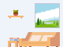

# svg-images

A playground to consider vector graphics included in the `` tag from an external source.

---

Run `npm run dev` to view the page on `http://localhost:5173/`. The instruction is ultimately unnecessary — you can very well test the page opening `index.html` yourself —, but you might enjoy the live environment.

---

- show the entire graphic

  ```html
  
  ```

- show a portion of the graphic defined through a `<view>` element

  ```html
  
  ```

  The view itself is predisposed in the `.svg` document

  ```html
  <view id="pie-chart" viewBox="400 0 100 100" />
  ```

- show a portion of the graphic with a _view fragment_

  ```html
  
  ```

  The values update the `viewBox` for the specific SVG

As you are able to selectively focus on parts of the graphic, it is possible to combine the feature with the `<picture>` element and show different images for different conditions, for instance the size of the viewport.

```html
<picture>
  <source
    srcset="./picture.svg#zoom"
    alt=""
    media="(max-width: 800px)"
    width="300"
    height="300"
  />
  
</picture>
```
